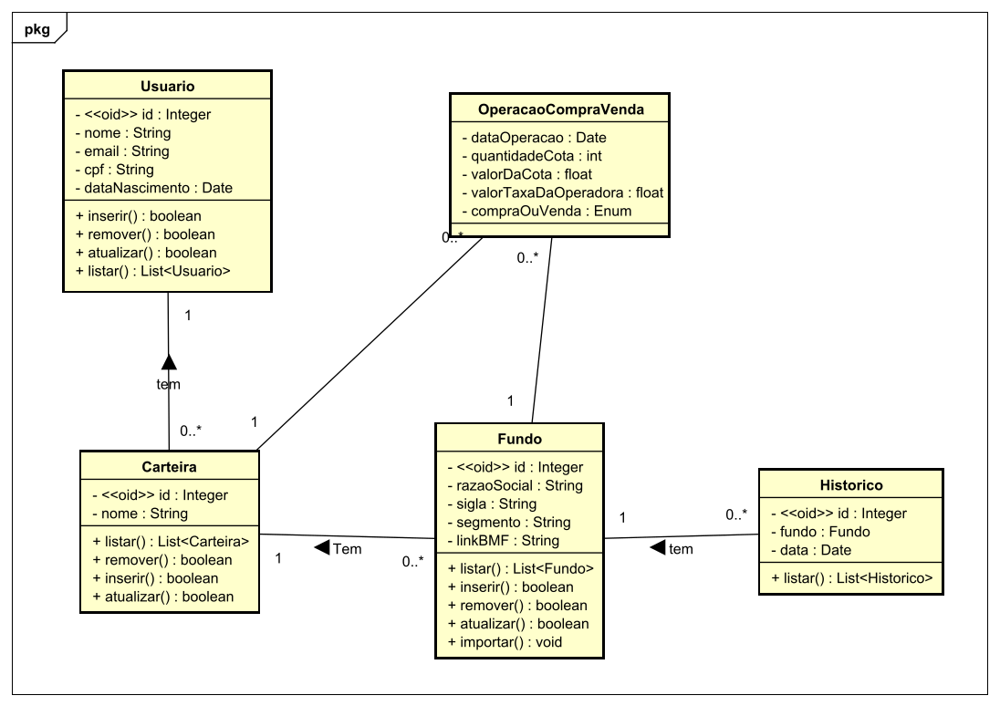
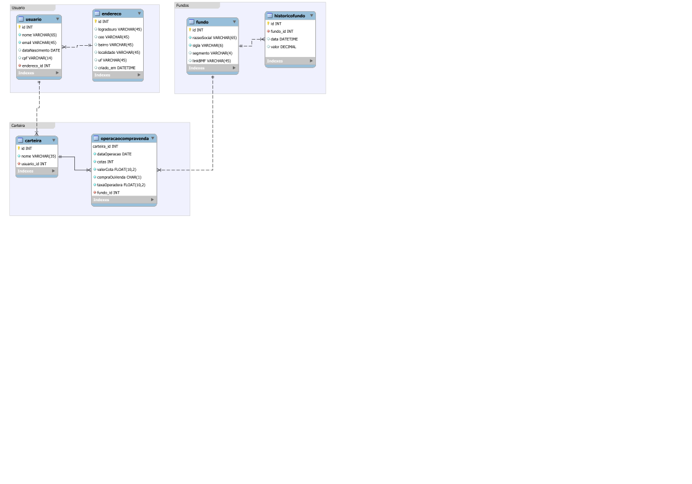

# Projeto MaisFII

Este projeto propõe no gerenciamento de carteira de Fundos de Investimentos Imobiliários

## Descrição
- Adicionar usuários via REST service ou manualmente (CRUD)
- Gerenciamento de Fundos (CRUD)
- Usuários podem gerenciar carteiras (CRUD)
  - Fazer operações de ativos - compra/venda de FII para uma carteira existente
- Listar valores de FII do dia X 
- Importação de dados de conteúdo através de planilhas (CSV)
- Tela de login com sessão

## UML

## Requisitos

- MySQL
- CODE-FIRST Workflow
- NuGet Pacotes
  - `Install-Package Microsoft.EntityFrameworkCore.Design -Version 3.0.1`
  - `Install-Package Pomelo.EntityFrameworkCore.MySql`
  - `Install-Package ChoETL.JSON -Version 1.1.0.4` - csv to json
  - `Install-Package PagedList.Mvc` - Paginação

## Desenvolvimento Fase 1 (trabalho da faculdade)
- Usuario
  - CRUD
- Carteira
  - CRUD
- Operações Compra/Venda
  - CRUD
- Fundos
  - Importado pelo dados do [Google Planilhas](https://docs.google.com/spreadsheets/d/17SQAgs-oHRguDJJGGk8mXcBD7FByQWpUQgKZYYIRpJU/edit), qual compõe o histórico diário a partir que o robot começar a operar, sendo executado 1 vez ao dia
  - Histórico dos Fundos
  - Importado pelo dados do [Google Planilhas](http://) em que terá a lista do último ano de cada fundo

### Banco de Dados

## TODO (Pós Faculdade)

- Segmentos
  - Cadadstro
- Tipo
  - Cadastro
- Gráficos
  - Carteira
    - Porcentual da composição da carteira de cada fundo - tipo pizza
    - Porcentual por tipo - tipo pizza
    - Porcentaul por segmentos - tipo p
    - Ganho de capital e dividendos de cada fundo da carteira
    - Dividendos pagos desde a primeira operação adicionada na carteira - tipo "stacked bar"
  - Histórico de dividendos de cada fundo

## Referências

- http://www.macoratti.net/17/05/efcore_mysql1.htm
- https://www.entityframeworktutorial.net/entity-relationships.aspx
- http://learningprogramming.net/net/asp-net-core-mvc/login-form-with-session-in-asp-net-core-mvc/
- https://www.learnrazorpages.com/razor-pages/ajax/unobtrusive-ajax
- https://docs.microsoft.com/pt-br/aspnet/mvc/overview/getting-started/getting-started-with-ef-using-mvc/sorting-filtering-and-paging-with-the-entity-framework-in-an-asp-net-mvc-application
